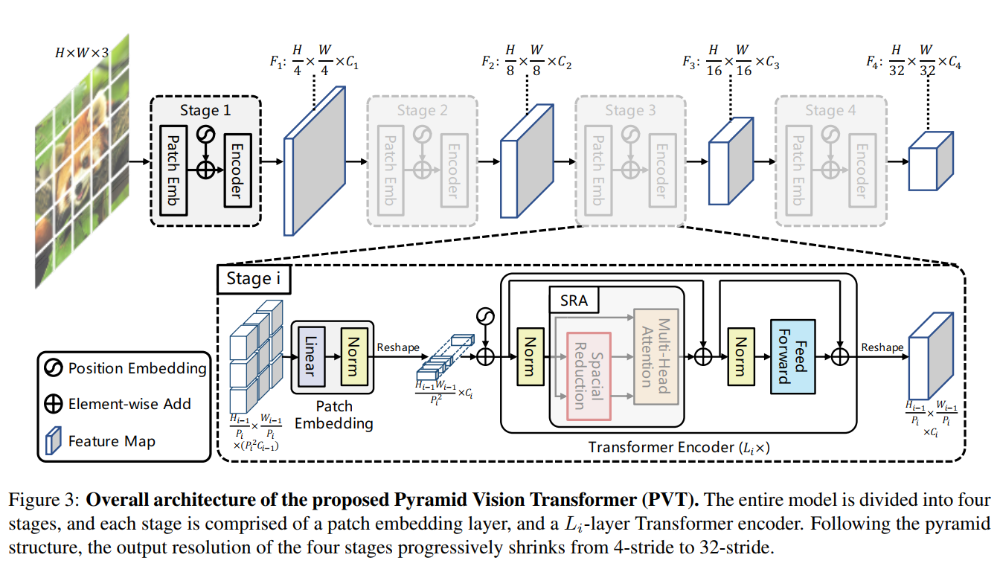
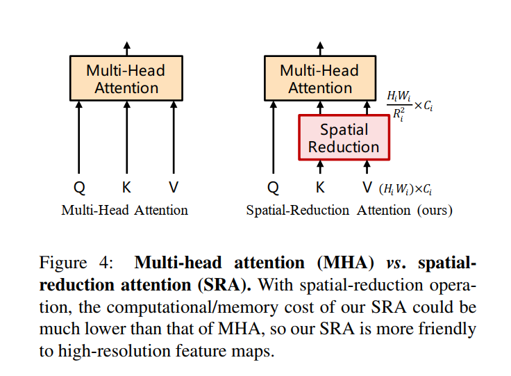
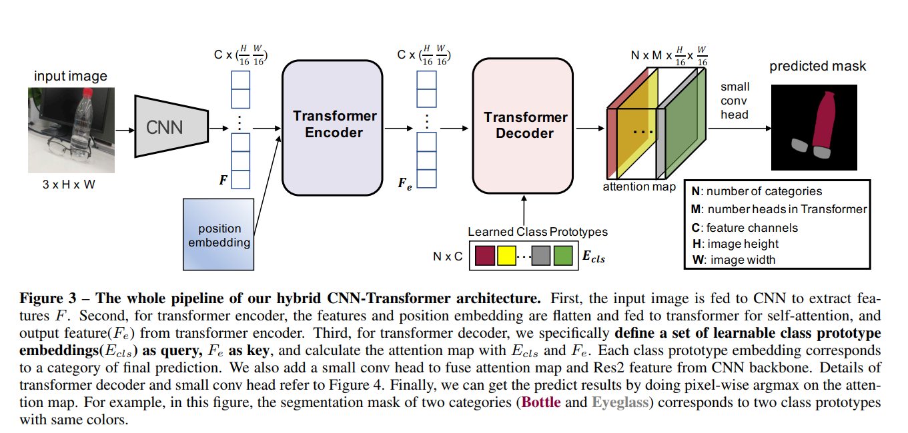

# Pyramid Vision Transformer: A Versatile Backbone for Dense Prediction without Convolutions (PVT)
- Wenhai Wang（Nanjing University）等
- Pyramid Vision Transformer用于semantic and instance segmentation， object detection
- [代码：github](https://github.com/whai362/PVT)  
-   
-   
- 
# Segmenting transparent object in the wild with transformer(Trans2Seg) 
- Enze Xie , Wenjia Wang, Wenhai Wang3
- The University of Hong Kong Sensetime Research Nanjing University
- [github](https://github.com/xieenze/Trans2Seg)  
-   
# MaX-DeepLab: End-to-End Panoptic Segmentation with Mask Transformers  
# Generative Adversarial Transformers （GANsformer）
- [github](https://github.com/dorarad/gansformer)
# Improving Semantic Segmentation via Self-Training  
# Transformer in Transformer (TNT)  
# TransGAN: Two Transformers Can Make One Strong GAN  
- [github](https://github.com/VITA-Group/TransGAN)  
- 