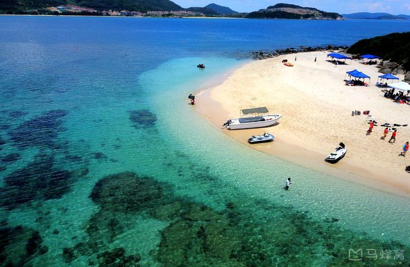

- day 1: 海口机场
- day 2：文昌 
 月亮湾  铜鼓岭  卫星发射基地
- day 3：
万宁 加井岛

无人岛之所以火是因为拍摄非诚勿扰2。加井岛会随季节而发生位移，因此称为“灵岛”海底珊瑚礁随处可见。加井岛基本都是俱乐部团建活动。都是外地人自己组建的俱乐部，团建的人比较多。
此岛海底资源丰富，石奇海美，不仅可以观海赏石，眺海揽秀，还可以潜水看珊瑚礁。海岛周围海域海水清澈，一般水下可看5-10米深，很适合海水下捕采。
- day 4：
陵水
清水湾   新村渔排村
- day 5：
- day 6：
- day 7：
- day 8：
- day 9：
- day 10：
- day 11：
- day 12：
- day 13：
- day 14：

